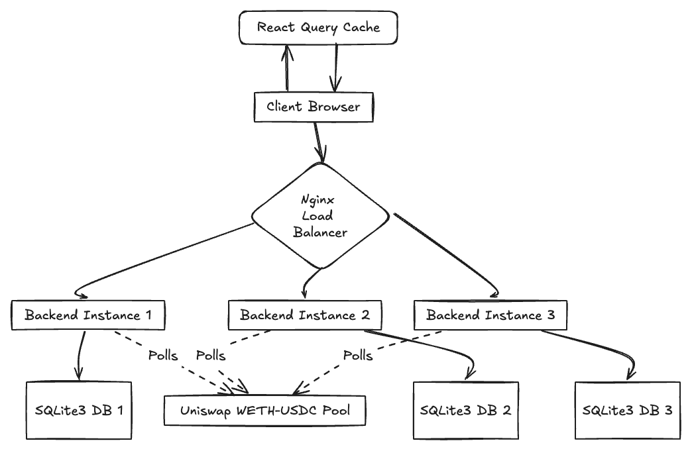

# Tokka-Labs
Transaction fee monitor for Uniswap's WETH-USDC pool

## Table of Contents
1. [Introduction](#introduction)
2. [Tech Stack](#tech-stack)
3. [Architecture](#architecture)
4. [Getting Started](#getting-started)
    - [Environment Setup](#environment-setup)
    - [Manual Setup](#manual-setup)
    - [Setup Using Scripts](#setup-using-scripts)
5. [Running Tests](#running-tests)
6. [Docker Instructions](#docker-instructions)

## Introduction
This project is a full-stack application that monitors and displays transaction fees for Uniswap's WETH-USDC pool. It provides real-time data recording and historical batch data retrieval, with a user-friendly interface for querying transactions.

## Tech Stack
- Frontend:
    - React
    - TypeScript
    - React Query
    - Tailwind CSS
    - ShadCN
- Backend:
    - Bun.js
    - Elysia
    - SQLite3
- DevOps:
    - Docker
    - Docker Compose
    - Nginx

## Architecture



The architecture consists of:
- A client-side React application with React Query for efficient data fetching and caching.
- Multiple backend instances for scalability and load balancing.
- Nginx as a reverse proxy to distribute requests among backend instances via Round Robin.
- SQLite3 databases for each instance for data persistence.

## Getting Started

### Environment Setup

Before proceeding with either the manual setup or setup using scripts, you need to set up your environment variables:

1. Navigate to the `backend` directory.
2. Copy the `.env.example` file to a new file named `.env`.
3. Open the `.env` file and fill in the necessary values for your environment.

### Manual Setup

1. Clone the repository:
   ```
   git clone https://github.com/howen02/Tokka-Labs/
   cd tokka-labs
   ```

2. Install dependencies:
   ```
   cd frontend
   npm install --legacy-peer-deps

   cd ../backend
   bun install
   ```

3. Start the development servers:
   ```
   cd backend
   bun run dev

   cd frontend
   npm run dev
   ```

4. Open your browser and navigate to `http://localhost:5173` to view the application.

### Setup Using Scripts

We provide two setup scripts for your convenience: one for local setup and one for Docker setup.

1. First, make the scripts executable:
   ```
   chmod +x local.sh docker.sh
   ```

2. For local setup, run:
   ```
   ./local.sh
   ```

3. For Docker setup, run:
   ```
   ./docker.sh
   ```

Remember to set up your environment variables as described in the [Environment Setup](#environment-setup) section before running these scripts.

## Running Tests

To run tests:

```
bun test
```

## Docker Instructions

1. Ensure Docker and Docker Compose are installed on your system.

2. Build and start the containers:
   ```
   docker-compose up --build
   ```

3. The application will be available at `http://localhost:5173`.

4. To stop the containers:
   ```
   docker-compose down
   ```