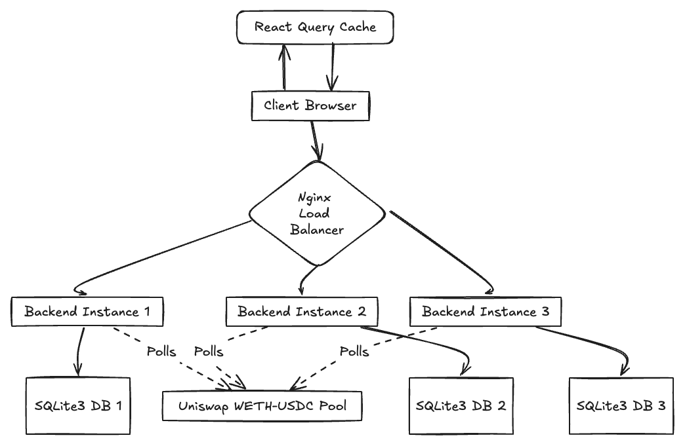
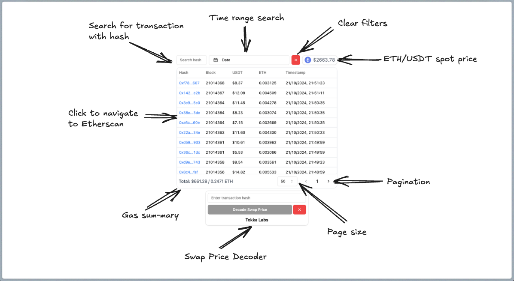

# Tokka-Labs
Transaction fee monitor for Uniswap's WETH-USDC pool

API Swagger Documentation can be found [here](https://app.swaggerhub.com/apis/WENHYAP02/TokkaLabs/1.0.0)

## Table of Contents
1. [Introduction](#introduction)
2. [Note](#note)
3. [Tech Stack](#tech-stack)
4. [Architecture](#architecture)
5. [Availability, Scalability, and Reliability](#availability-scalability-and-reliability)
6. [Getting Started](#getting-started)
    - [Environment Setup](#environment-setup)
    - [Local Setup](#local-setup)
7. [Running Tests](#running-tests)
8. [Docker Instructions](#docker-instructions)
9. [Check List](#check-list)

## Introduction
This project is a full-stack application that monitors and displays transaction fees for Uniswap's WETH-USDC pool. It provides real-time data recording and historical batch data retrieval, with a user-friendly interface for querying transactions.

## Note
Due to Binance API's rate limit, some transactions may not be available. This is because I chose to fetch the historical ETH price when the transaction occurs to reflect more accurate gas prices.

When batch-fetching past transactions, the Binance API is used to get the ETH-USD spot price for each timestamp. This exceeds the API's rate limit and will result in an IP ban. 

## Tech Stack
### Frontend:
- React
- TypeScript
- React Query
- Tailwind CSS
- ShadCN
### Backend:
- Bun.js:
    - Chosen for its high performance and compatibility with JS/TS
    - Offers significantly faster startup times compared to Node.js
    - Built-in TypeScript support without need for separate compilation step
    - Includes a fast, SQLite-compatible database API

- Elysia:
    - A high-performance web framework built for Bun
    - Offers TypeScript support out of the box
    - Provides a simple, expressive API for building web applications
    - Designed to take full advantage of Bun's performance optimizations

- SQLite3:
    - Lightweight, serverless database that doesn't require a separate server process
    - It came with Bun
### DevOps:
- Docker
- Docker Compose
- Nginx

The backend stack was chosen out of my personal interest to explore Bun and its ecosystem, including the Elysia framework and the built-in SQLite3 support that comes with it.

## Architecture



The architecture consists of:
- A client-side React application with React Query for efficient data fetching and caching.
- Multiple backend instances for scalability and load balancing.
- Nginx as a reverse proxy to distribute requests among backend instances via Round Robin.
- SQLite3 databases for each instance for data persistence.

### Frontend Design


## Availability, Scalability, and Reliability

This project has been designed with availability, scalability, and reliability in mind:

1. Availability:
    - Multiple backend instances ensure that the service remains available even if one instance fails.
    - Nginx acts as a reverse proxy, automatically routing requests to healthy instances.
    - React Query on the frontend provides caching and stale-while-revalidate functionality, allowing the UI to remain responsive even during temporary backend outages.

2. Scalability:
    - The use of Docker and Docker Compose allows for easy horizontal scaling by adding more backend containers.
    - Nginx's load balancing capabilities distribute incoming requests across multiple backend instances, preventing any single instance from becoming a bottleneck.
    - The frontend is built as a static single-page application, which can be easily distributed via CDNs for global scalability.

3. Reliability:
    - Each backend instance has its own SQLite database, reducing the risk of a single point of failure for data storage.
    - Use of TypeScript in both frontend and backend improves code reliability through static typing.
    - Docker ensures consistent environments across development, testing, and production, reducing environment-related issues.

These design choices allow the system to handle increased load, recover from failures, and provide a consistent UX even under stress.

## Getting Started

### Bun

In this project, we're using Bun as it is a fast all-in-one JavaScript toolkit. We used it as our JavaScript runtime, package manager, and testing framework. To install Bun, follow these steps:

1. **For macOS or Linux:**
   Open a terminal and run the following command:
   ```
   curl -fsSL https://bun.sh/install | bash
   ```
   This script will download and install Bun on your system.

2. **For Windows:**
   Bun can be installed on Windows using Windows Subsystem for Linux (WSL). Follow these steps:
    - Install WSL by following the [official Microsoft guide](https://docs.microsoft.com/en-us/windows/wsl/install).
    - Once WSL is set up, open your WSL terminal and run the same command as for macOS/Linux:
      ```
      curl -fsSL https://bun.sh/install | bash
      ```

3. **Verify the installation:**
   After installation, you can verify that Bun is correctly installed by running:
   ```
   bun --version
   ```
   This should display the version of Bun you've installed.

### Environment Setup

You will need an API key from Etherscan, sign up for one [here](https://etherscan.io/apis). The free tier is generous enough as it offers 100,000 free API calls per day.

### Local Setup

1. Clone the repository:
   ```
   git clone https://github.com/howen02/Tokka-Labs/
   cd tokka-labs
   ```
   
2. Navigate to the backend directory, copy the `.env.example` file to a new file named `.env`, and fill in the API key for Etherscan.

3. Install dependencies:
   ```
   cd frontend
   npm install --legacy-peer-deps

   cd ../backend
   bun install
   ```

4. Start the development servers, each in a separate terminal:
   ```
   cd backend
   bun run dev

   cd frontend
   bun run dev
   ```

4. Open your browser and navigate to `http://localhost:5173` to view the application.

## Running Tests

To run tests:

    ```
    bun test
    ```

## Docker Instructions

1. Head to `constants.ts` in the frontend directory and swap the backend urls

    ```
    // Comment this out for docker, this points to the backend
    export const BACKEND_URL = 'http://localhost:3000'
    
    // Uncomment this for docker, this points to the NGINX proxy
    // export const BACKEND_URL = 'http://localhost:8080'
   ```

2. Ensure Docker and Docker Compose are installed on your system.

3. Build and start the containers:
   ```
   docker-compose up --build
   ```
   
4. The application will be available at `http://localhost:4173`.

5. To stop the containers:
   ```
   docker-compose down
   ```

## Check List

### Version Control
- [x] Use Git for version control
- [x] Code is accessible on a public Git service (e.g., GitHub)
- [x] Multiple commits showing solution evolution

### Testing
- [x] Comprehensive test suite written for the code

### Containerization
- [x] Applications dockerized with docker-compose
- [x] UI and Backend run in separate containers (if not using a full-stack framework)

### Documentation
- [x] Clear README.md file included
- [x] Build instructions provided
- [x] Test instructions provided
- [x] Run instructions provided
- [x] Architectural principles and reasons for choices explained
- [x] Design considerations for tools (DB, caching, message queue, etc.) explained

### Coding Style
- [x] Follow a well-known coding style guide (e.g., pep8 for Python)

### Backend Requirements
- [x] Track all transactions in Uniswap V3 USDC/ETH pool
- [x] Record transaction fee in USDT at time of confirmation
- [x] Support real-time data recording
- [x] Support historical batch data recording
- [x] Provide endpoint(s) to get transaction fee for given transaction hash
- [x] Design RESTful API with clear interface specifications

### UI Requirements
- [x] One-page application with query form
- [x] Search by txId/hash and time range
- [x] Show list of transactions (latest first) with pagination
- [x] Default pagination limit of 50 transactions per page
- [x] Allow users to change page size and page index
- [x] Static component to summarize data:
    - [x] Total transaction fee in USDT
    - [x] Total transaction fee in ETH
    - [x] Current ETH/USDT price

### Bonus (Optional)
- [x] Consider and explain availability, scalability, and reliability in system design
- [ ] Decode actual Uniswap swap price executed for each transaction (NOT IMPLEMENTED)
